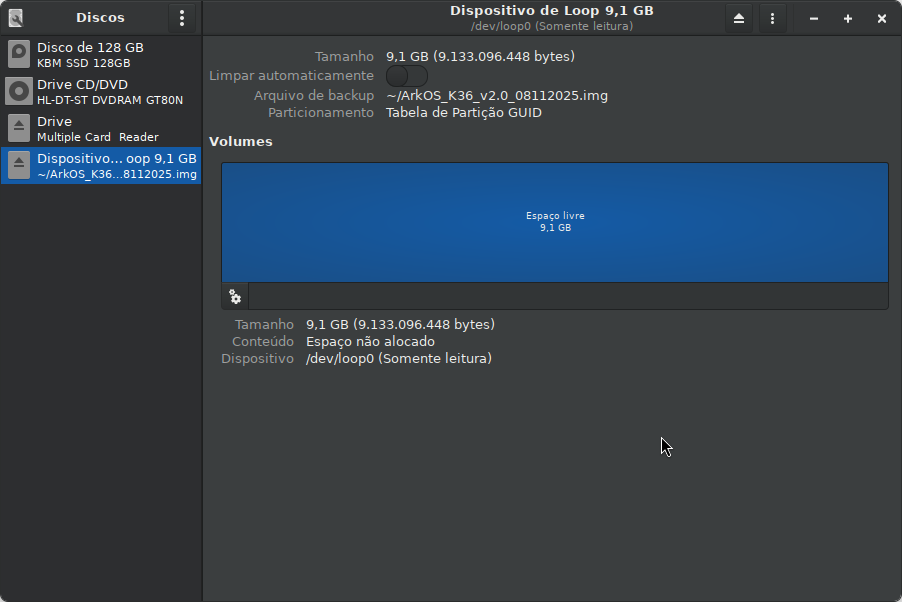
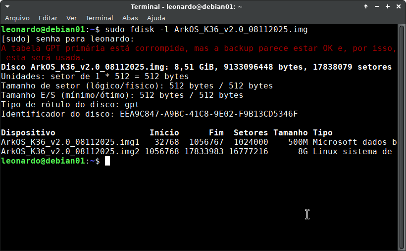
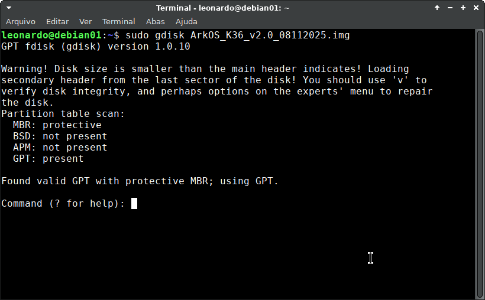
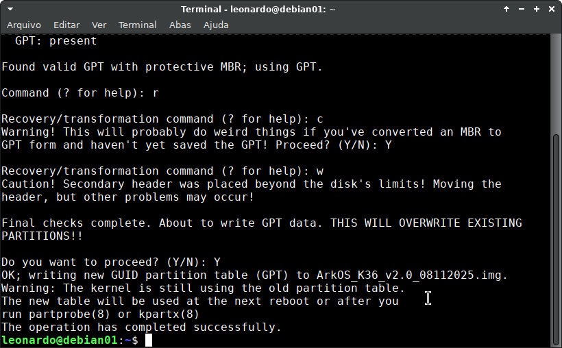
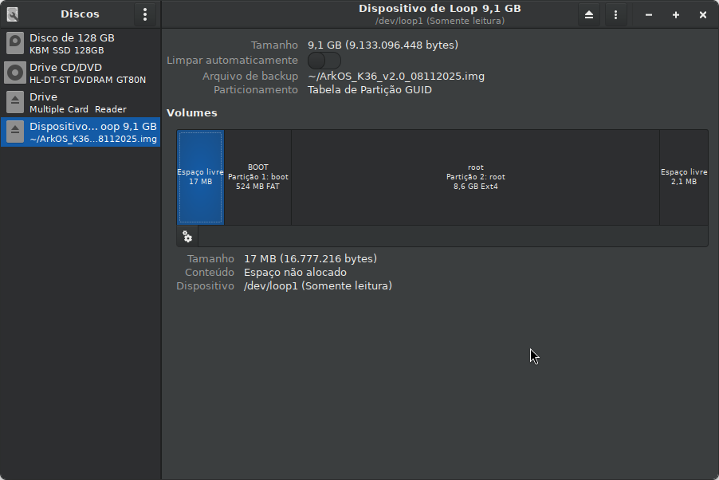
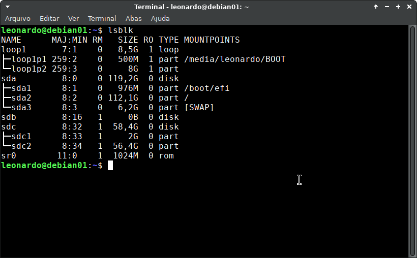
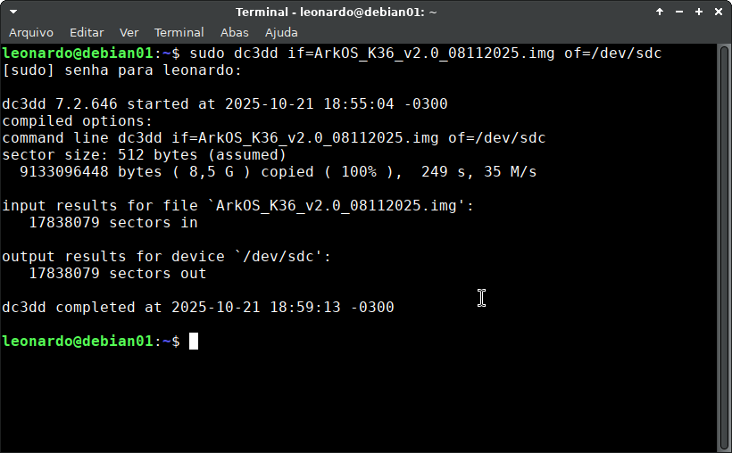
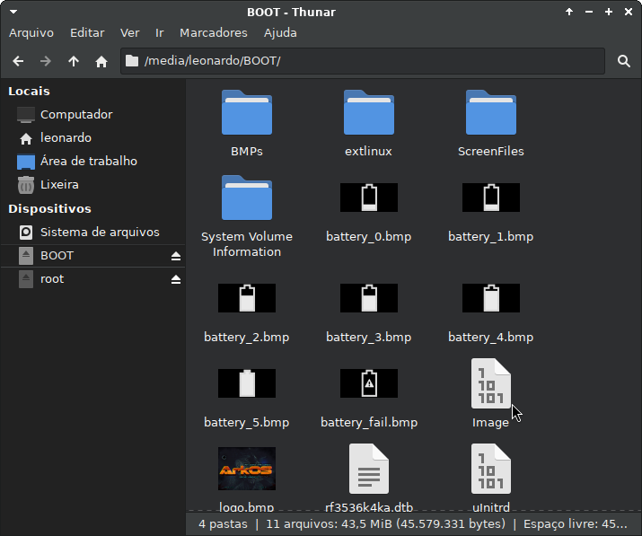
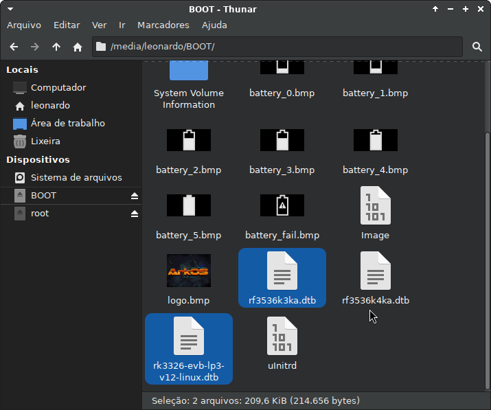
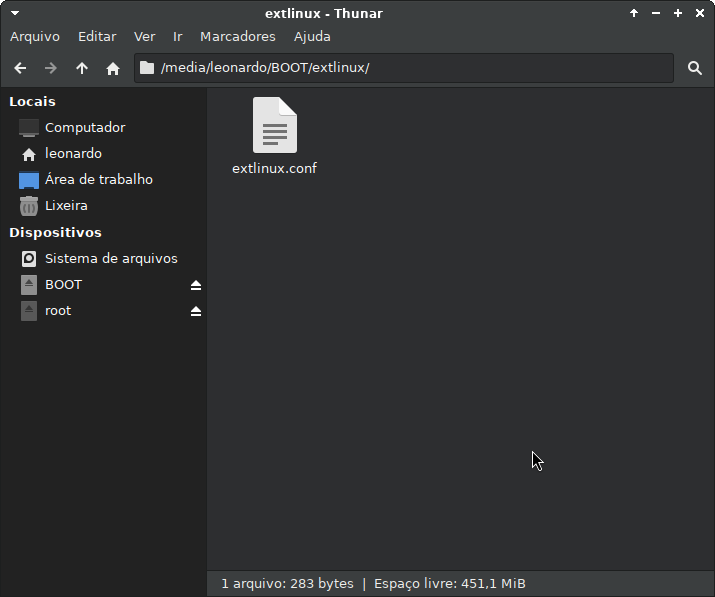

# Tutorial de Instalação do ArkOS no R36S Clone

## 📋 Introdução

Este tutorial foi desenvolvido para usuários Linux que estão enfrentando problemas na gravação da imagem **ArkOS_K36_v2.0_08112025.img.xz** em consoles R36S Clone. Alguns usuários relataram que a imagem aparece "vazia" sem partições visíveis - problema que também enfrentei pessoalmente.

### Hardware Utilizado
- **Console**: R36S (Clone)
- **Identificação da placa**: G80C - MB V1.1 - 20250319

## ❓ Problema Identificado

Inicialmente, suspeitei de corrupção no download devido à conexão de internet, mas após análise, constatei que o arquivo disponibilizado no repositório requer ajustes específicos.

**Por que isso ocorre?**  
Ao gravar a imagem em sistemas operacionais diferentes do Windows, alguns softwares (incluindo Balena Etcher) apresentam comportamento diferenciado na interpretação da tabela de partições.

## 🛠️ Ferramentas Necessárias

- `gnome-disk-utility` (opcional)
- `fdisk`
- `gdisk`
- `dd`
- `dc3dd`
- `mousepad` (ou qualquer editor de texto)
- `wget`

## 📥 Download e Extração da Imagem

### Obtenha a imagem do ArkOS:
```bash
wget https://github.com/AeolusUX/ArkOS-K36/releases/download/ArkOS.K36.08112025/ArkOS_K36_v2.0_08112025.img.xz
```

### Extraia o arquivo:
```bash
xz -d ArkOS_K36_v2.0_08112025.img.xz
```

## 🔍 Identificação do Problema

Ao tentar montar a imagem extraída, você notará que ela não apresenta partições devido ao erro na tabela GPT:



### Verificação com fdisk:
```bash
sudo fdisk -l ArkOS_K36_v2.0_08112025.img
```

**Saída esperada:**
```
Dispositivo                   Início      Fim  Setores Tamanho Tipo
ArkOS_K36_v2.0_08112025.img1   32768  1056767  1024000    500M Microsoft dados básico
ArkOS_K36_v2.0_08112025.img2 1056768 17833983 16777216      8G Linux sistema de arquivos
```



**Atenção:** Observe a mensagem no topo indicando que a tabela GPT primária está corrompida.

## 🔧 Correção da Tabela de Partições

### Execute o gdisk:
```bash
sudo gdisk ArkOS_K36_v2.0_08112025.img
```

**Interface do gdisk:**
```
Partition table scan:
  MBR: protective
  BSD: not present
  APM: not present
  GPT: present

Found valid GPT with protective MBR; using GPT.

Command (? for help):
```



### Procedimento de correção:

1. **Acesse o menu de recuperação** - Pressione `r` + Enter
2. **Crie nova tabela de partições** - Pressione `c` + Enter → Confirme com `Y` + Enter
3. **Escreva as alterações** - Pressione `w` + Enter → Confirme com `Y` + Enter



### Verificação da correção:
Após o procedimento, a imagem deve exibir as partições corretamente:



## 💾 Gravação no Cartão MicroSD

### Identifique o dispositivo:
```bash
lsblk
```



**⚠️ Atenção:** Identifique corretamente o dispositivo do seu cartão SD para evitar perda de dados!

### Gravação com dc3dd (recomendado):
```bash
sudo dc3dd if=ArkOS_K36_v2.0_08112025.img of=/dev/sdc
```

### Gravação com dd (alternativa):
```bash
sudo dd if=ArkOS_K36_v2.0_08112025.img of=/dev/sdc status=progress
```

### Finalização:
```bash
sudo sync
sudo eject /dev/sdc
```



## ⚙️ Configuração do DTB

### Verifique as partições gravadas:


### Acesse a partição BOOT:


### Adicione os arquivos DTB:
Para consoles com **tipo de tela 8**, adicione os seguintes arquivos à raiz da partição BOOT:
- `rf3536k3ka.dtb`
- `rk3326-evb-lp3-v12-linux.dtb`

**Disponíveis em:** [arquivos_dtb_originais](https://github.com/souza-lb/tutorial-r36s-clone/tree/main/arquivos_dtb_originais)



### Configure o arquivo extlinux:
Navegue até a pasta `extlinux` na partição BOOT e edite o arquivo de configuração:



**Conteúdo original:**
```bash
LABEL ArkOS
  LINUX /Image
  FDT /rf3536k4ka.dtb
  INITRD /uInitrd
  APPEND earlyprintk console=ttyFIQ0 rw root=/dev/mmcblk1p2 rootfstype=ext4 loglevel=7 init=/sbin/init rootwait rootdelay=10 fsck.repair=yes fbcon=rotate:0 quiet splash plymouth.ignore-serial-consoles consoleblank=0
```

**Altere para:**
```bash
LABEL ArkOS
  LINUX /Image
  FDT /rf3536k3ka.dtb
  INITRD /uInitrd
  APPEND earlyprintk console=ttyFIQ0 rw root=/dev/mmcblk1p2 rootfstype=ext4 loglevel=7 init=/sbin/init rootwait rootdelay=10 fsck.repair=yes fbcon=rotate:0 quiet splash plymouth.ignore-serial-consoles consoleblank=0
```

**Mudança principal:** Linha `FDT /rf3536k3ka.dtb`

### Finalize:
```bash
sudo sync
sudo eject /dev/sdc
```

## 🎮 Primeiro Boot

Insira o cartão no console e aguarde. No primeiro boot:
- O sistema expandirá automaticamente a partição `easyroms`
- A interface do ArkOS será carregada

---

## 🙏 Apoie os Desenvolvedores Originais

<div align="center" style="background-color: #f5f5f5; padding: 20px; border-radius: 10px; margin: 20px 0;">

### 🚀 Projeto ArkOS Original

**Visite e contribua com o projeto ArkOS:**  
[github.com/AeolusUX/ArkOS-K36](https://github.com/AeolusUX/ArkOS-K36)

**Faça uma doação para o desenvolvedor do ArkOS:**  
[ko-fi.com/aeolusux](https://ko-fi.com/aeolusux)

</div>

---

## 💝 Apoie o Desenvolvedor deste Tutorial

**Dúvidas, sugestões e contribuições?**  
**Leonardo Bruno**  
📧 `souzalb@proton.me`

**Gostou do tutorial e quer realizar uma contribuição voluntária?**  
*(Pode ser o valor de uma xícara de café ou chá...)* ☕ 🍵

### 🇧🇷 PIX (Brasil)
**Chave PIX:** `8dcc7e3c-0c6a-4c6f-a4c0-26a5e62686db`

<p align="center">
  
</p>

### 🌎 PayPal
[](https://www.paypal.com/donate/?hosted_button_id=EQVW5QQ7GBGSY)

<p align="center">
  
</p>

---

## 📄 Licença

**A utilização deste projeto é livre para alterações e adaptações**  
*Desde que feita a devida referência ao repositório original e seu criador.*

---

<div align="center">
  
**⭐ Se este tutorial foi útil, considere dar uma estrela no repositório!**

</div>
